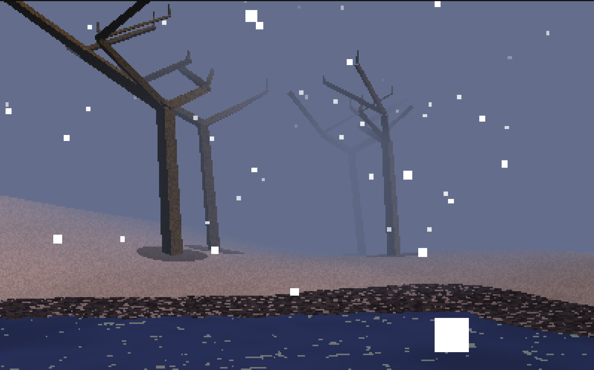
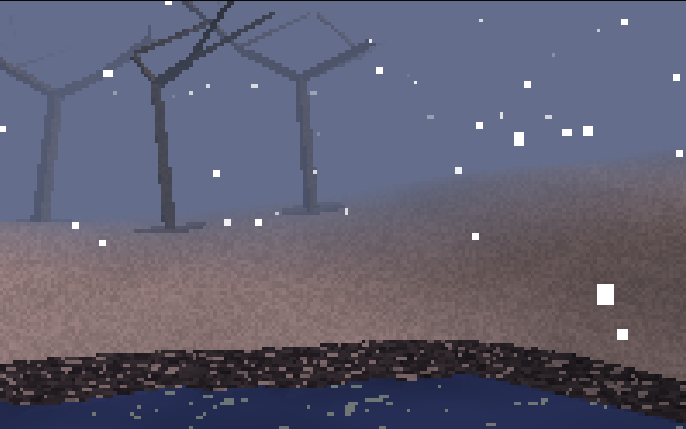

  <h1>Tundra</h1>
  
  

| | |
|:-------------------------:|:-------------------------:
|  | 
|  |

Wander forever

## About

Tundra is a real-time 3D procedural world renderer built with a custom software rasterizer. Explore an infinite frozen landscape featuring dynamic weather, realistic terrain generation, and atmospheric lighting effects. The engine renders everything from scratch using CPU-based rasterization, creating a unique visual style reminiscent of early 3D graphics with modern procedural generation techniques.

The world generates seamlessly as you move, creating vast tundra landscapes with rolling hills, frozen lakes, scattered trees, and falling snow particles. Experience the passage of time through a dynamic day/night cycle that transforms the atmosphere from deep blue dawn to bright noon, warm dusk, and dark midnight.

## Keybindings
| Key | Function |
|:-------------------------:|:-------------------------:
| W | Move Forward |
| A | Move Left |
| S | Move Back |
| D | Move Right |
| 1 | Normal FPS style view (Default) |
| 2 | Birds-eye view |
| 3 | Wireframe view |
| Space | Capture mouse |
| ESC | Exit |

## Features

- **Infinite Procedural World**: Endless terrain generation using Perlin noise and procedural algorithms
- **Dynamic Day/Night Cycle**: 2-minute cycles with smooth color transitions affecting sun and fog colors
- **Real-time Weather Effects**: Falling snow particle system with realistic physics and wind simulation
- **Custom Software Rasterizer**: Pure CPU-based 3D rendering with no GPU dependency
- **Procedural Terrain**: Rolling hills, frozen lakes with ice textures, and gravel shores
- **Atmospheric Rendering**: Distance fog that changes color with time of day
- **Tree Generation**: Procedurally placed vegetation with shadow casting
- **Multiple Camera Modes**: First-person exploration, overhead map view, and wireframe debugging
- **Chunk-based Loading**: Efficient memory management with dynamic world streaming
- **Cross-platform**: MAc and Linux confirmed, supports all platforms SDL3 supports